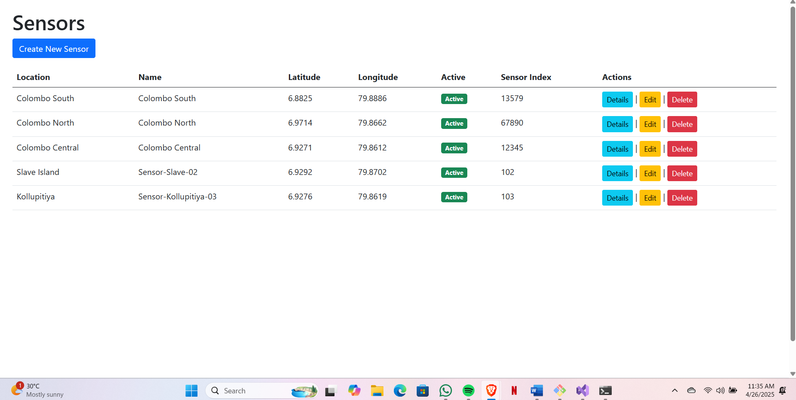
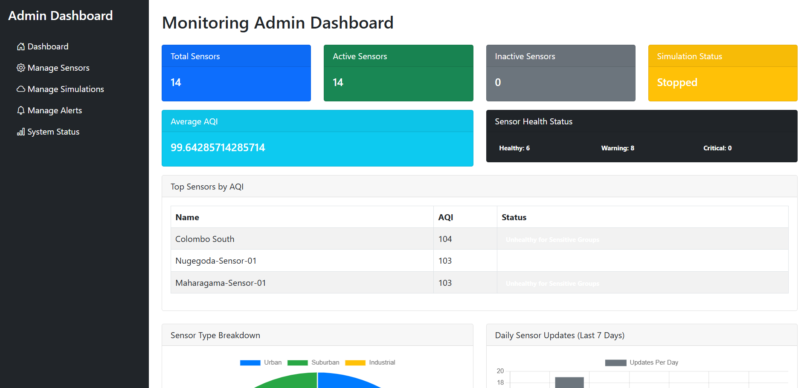
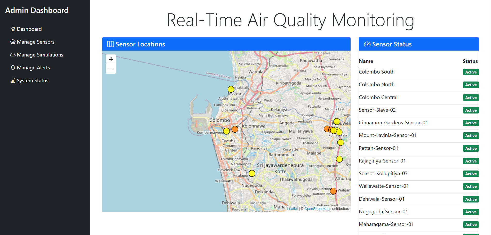
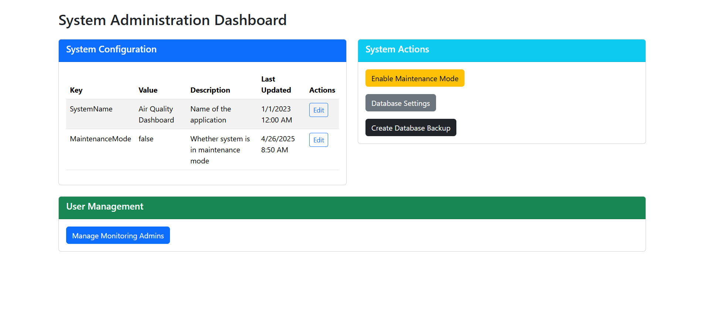

# 🌍 Air Quality Monitoring Dashboard

A web application to monitor air quality data from multiple sensors with **role-based access**, real-time visualization, and a strong focus on **testing and reliability**. Developed as part of **Software Development Tools and Practices (PUSL2020)**.

---

## 🎯 Highlights

- Public dashboard with AQI visualization  
- Role-based authentication (Public, Monitoring Admin, System Admin)  
- Sensor management (CRUD) & simulated data generation  
- Alert thresholds & admin dashboards for system monitoring  
- Strong focus on **unit, integration, and functional testing**

---

## 🛠 Tech Stack

**Backend:** ASP.NET Core | **Frontend:** Razor Pages / MVC Views  
**Database:** Entity Framework Core | **Auth:** ASP.NET Identity  
**Testing:** xUnit, Moq, EF Core In-Memory Database  
**Visualization:** Chart.js, interactive maps  

---

## 👩‍💻 My Contributions

- Developed public dashboard UI & AQI charts  
- Integrated live sensor map view  
- Fetched simulated data and improved usability  
- Ensured reliability through testing strategies  

---

## 📸 Screenshots

  
 

⭐ Demonstrates skills in **secure web apps, role-based systems, full-stack development, and professional testing practices**.
